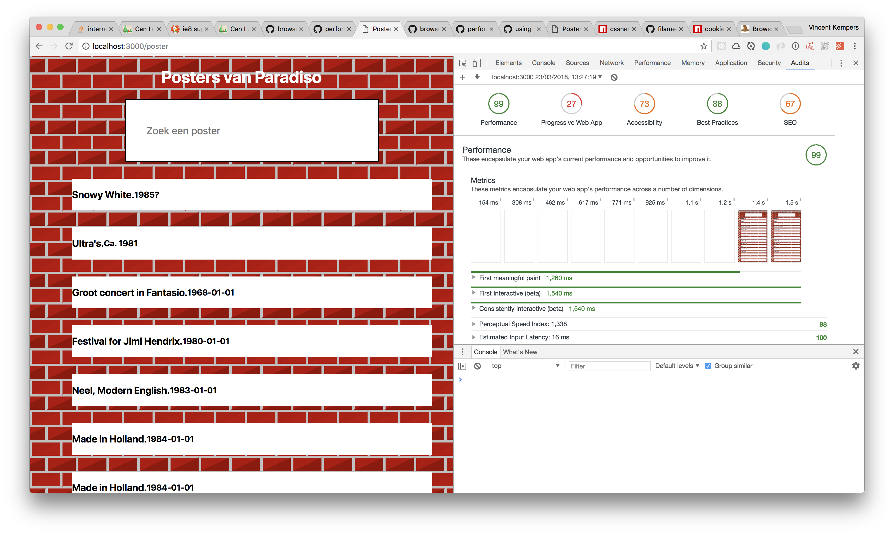
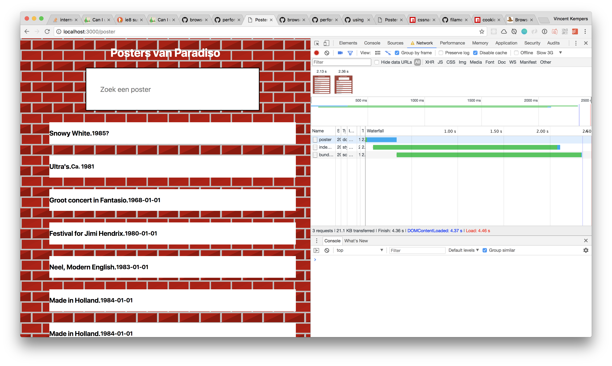

# performance-matters-server-side

## Poster Paradiso
You can look up posters from old concerts! Of Paradiso

## How to run
`npm install`

First run
`npm run build`
bundle the files with JS

to run the server
`npm test`

## Modules
* [expressJS](https://expressjs.com/)
* [Pug](https://pugjs.org/api/getting-started.html)
* [nodemon](https://nodemon.io/)
* [body-parser](https://www.npmjs.com/package/body-parser)
* [browserify](http://browserify.org/)

## audits

_99! performance matters_

_Fast 3g Speeds_

_Slow 3g Speeds_
